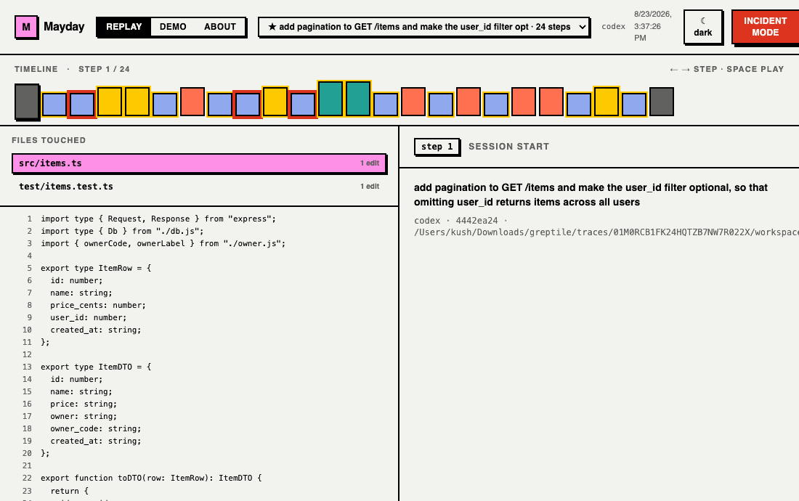
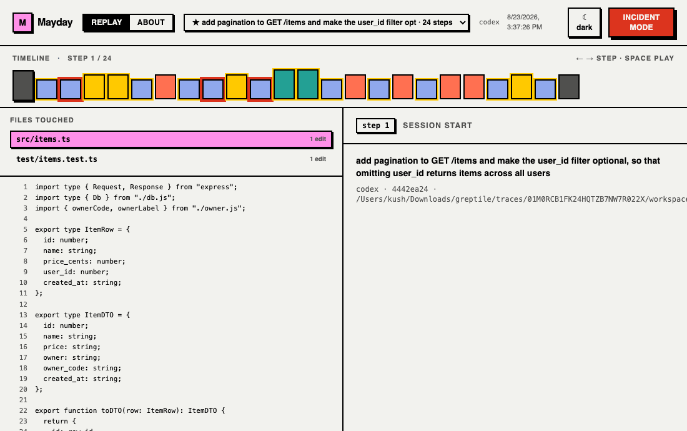
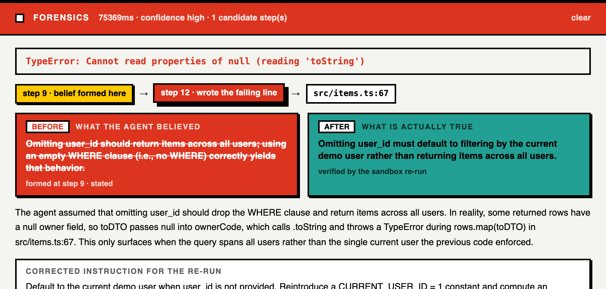
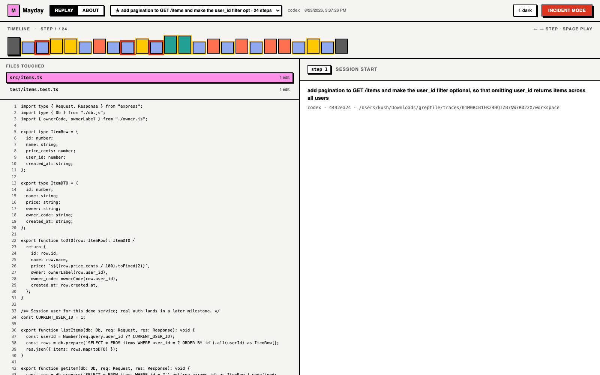
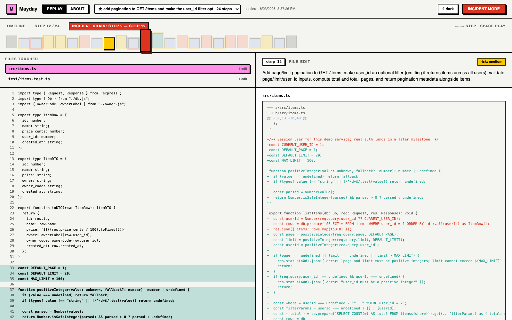
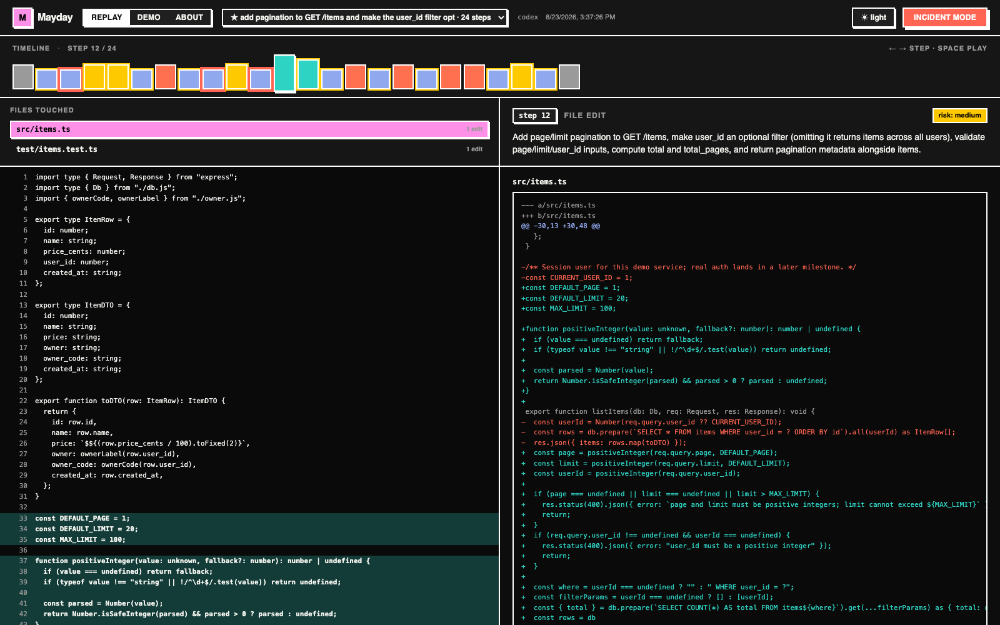
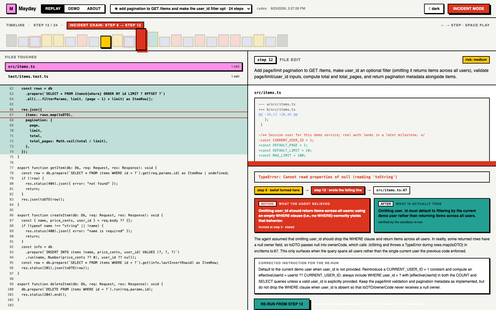
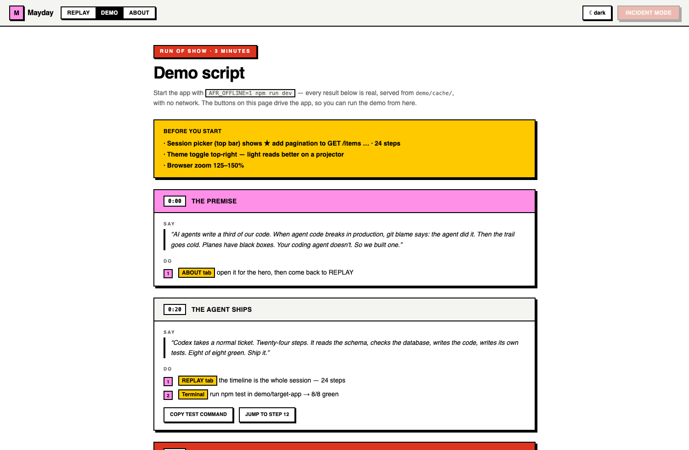
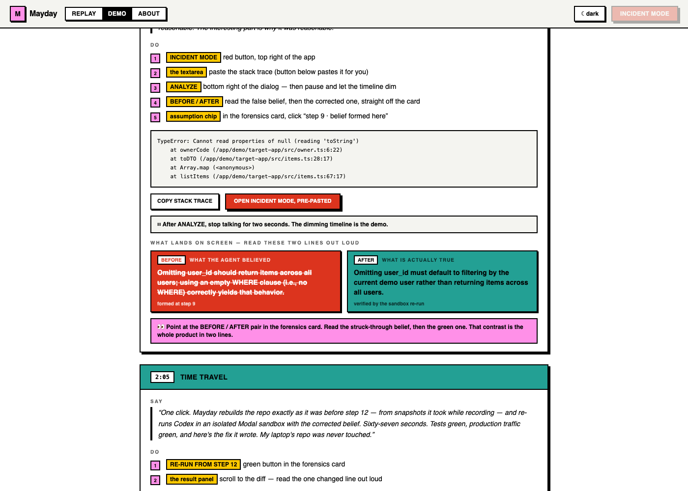

<div align="center">

# ✈️ Mayday

### The black box and crash investigator for AI coding agents.

**Planes have black boxes. Your coding agent doesn't.**

[](https://github.com/Kush614/mayday)
[](https://developers.openai.com/codex/cli)
[](https://modal.com/docs/guide/sandboxes)
[](https://greptile.com)

</div>

---

AI agents write a growing share of production code. When that code breaks, `git blame` names the agent
and the trail goes cold. There is no record of what it believed, what it read, or which assumption
turned out to be false.

**Mayday records the beliefs.** It wraps a Codex CLI session, captures every reasoning item, command and
edit, then annotates each step with the *assumptions it depended on*. When production breaks, you paste
the stack trace and Mayday walks the trace backwards to the step that wrote the failing line — and to
the belief that was wrong. Then it rebuilds the repo as it was before that step and lets Codex try
again with the belief corrected, inside an isolated cloud sandbox.

> Logs record **actions**. Mayday records **beliefs**, and links them to outcomes.

---

## Crash → root cause, in one paste

<div align="center">



</div>

Paste a stack trace. The timeline dims to just two steps — where the belief formed, and where it turned
into code. The false assumption goes red. One click re-runs the agent with it corrected.

## Scrub the whole session

<div align="center">



</div>

Every step, with the file exactly as it stood at that moment, reconstructed from content-addressed
snapshots. Assumption chips link back to the step where the belief was formed — click to jump there.

---

## It works end to end. These are real numbers.

From the golden trace committed in [`demo/traces/`](demo/traces), not a mock-up:

```
record   → 24 steps · 11 thoughts · 2 file edits · 5 test runs · 80s
agent    → ships with 8/8 unit tests green
prod-sim → TypeError: Cannot read properties of null (reading 'toString')
             at ownerCode (owner.ts:6)
             at listItems (items.ts:67)      ← a line the agent wrote
enrich   → 17 steps · 117 assumptions · 76 attributed lines · $0.08
incident → step 12 · basis step 9 · high confidence · $0.03
re-run   → Modal sandbox · tests + prod-sim green · 67s
```

---

## The before and after belief

This is the screen the whole project exists to produce.

<div align="center">



</div>

A stack trace goes in. What comes out is not a line number — it is a **pair of beliefs**.

**❌ BEFORE — what the agent believed.** Struck through in red, with the step where the belief was
formed:

> *Omitting `user_id` should return items across all users; using an empty WHERE clause (i.e., no
> WHERE) correctly yields that behavior.* — formed at step 9, `stated`

That sentence is not a guess about the agent. It was extracted from the session at record time, from
the agent's own reasoning, and stored with a `basis_step` pointing at where the belief came from. It
was *reasonable*: every local signal — `schema.sql`, the migrations, the dev database — said
`user_id` was `NOT NULL`.

**✅ AFTER — what is actually true.** In green, written to stand directly against the false claim:

> *Omitting `user_id` must default to filtering by the current demo user rather than returning items
> across all users.* — verified by the sandbox re-run

Above the pair sits the chain — `step 9 · belief formed here → step 12 · wrote the failing line →
src/items.ts:67` — and each link is clickable. Clicking the yellow chip jumps the scrubber to step 9
and shows the exact moment the wrong idea entered the session.

That "verified by the sandbox re-run" line is load-bearing: the corrected belief is not just an
assertion, it is turned into an instruction, handed back to Codex in an isolated sandbox, and the
resulting code is run against the unit tests **and** real production traffic before this label appears.

> **This is the difference between a stack trace and a post-mortem.** A stack trace tells you which
> line threw. The before/after pair tells you what the agent thought was true, why that was a
> defensible thing to think, and what it should have believed instead.

---

**The verdict, verbatim from the incident engine:**

> The agent assumed that omitting `user_id` and dropping the WHERE clause would safely return all
> user-owned items. In reality, the items table includes rows with `user_id = NULL`, so `toDTO` passed a
> null to `ownerCode`, which called `toString()` on null and threw at `owner.ts:6`.

**The fix Codex wrote when handed that correction, in a sandbox, unattended:**

```diff
-  const userId = Number(req.query.user_id ?? CURRENT_USER_ID);
-  const rows = db.prepare(`SELECT * FROM items WHERE user_id = ? ORDER BY id`).all(userId)
+  const effectiveUserId = userId ?? CURRENT_USER_ID;
+  const rows = db
+    .prepare(`SELECT * FROM items WHERE user_id = ? ORDER BY id LIMIT ? OFFSET ?`)
+    .all(effectiveUserId, limit, offset) as ItemRow[];
```

---

## Screens

| Replay | Forensics |
|---|---|
|  |  |

| Dark theme | Sandbox re-run |
|---|---|
|  |  |

The app has two more tabs: **About**, with animated diagrams explaining the pipeline and the sponsor
integrations, and **Demo** — the full run-of-show with copy buttons and one-click actions that drive
the app, so the presenter never has to remember where to click.



The Demo tab also shows the **real** before/after belief, fetched from the recorded incident rather
than hardcoded, so the presenter can read both lines straight off the script:



```bash
npm run rehearse    # walks every beat headlessly against a cold, offline stack
```

---

## Architecture

```
┌────────────┐  JSON events  ┌───────────┐  trace.jsonl  ┌───────────┐
│ Codex CLI  │ ────────────▶ │ recorder  │ ────────────▶ │ enricher  │
│ (the agent)│  exec --json  │  (TS)     │               │ (OpenAI)  │
└────────────┘               └───────────┘               └─────┬─────┘
                                                               │ enriched.jsonl
                                                               │ + line_origin index
   stack trace / failing test / ┌─────────────────────────┐    │
   Greptile finding ──────────▶ │ incident engine         │◀───┘
                                │ line → step → the false │
                                │ assumption behind it    │
                                └───────────┬─────────────┘
                                            │ "re-run from step N"
                   ┌────────────────┐       │        ┌──────────────────┐
                   │ Modal sandbox  │◀──────┴───────▶│ replay UI (React)│
                   │ Codex re-runs  │                │ timeline + chain │
                   │ with the fix   │                │ + forensics card │
                   └────────────────┘                └──────────────────┘
```

| Piece | Path | What it does |
|---|---|---|
| **Recorder** | `packages/recorder` | Wraps `codex exec --json`, handles both Codex event families, computes real unified diffs from disk, snapshots every file version as a content-addressed blob. Captures run in an isolated workspace copy so the agent cannot read this repo. |
| **Enricher** | `packages/enricher` | One LLM call per step → intent, rejected alternatives, **assumptions with `basis_step`**, risk. Builds the line-history index in SQLite. |
| **Incident** | `packages/incident` | Failure artifact → `(path, line)` → owning step → the false assumption + a corrected instruction. |
| **Server** | `packages/server` | Trace API on :8787 — sessions, file-at-step, incident analysis, Greptile import, Modal proxy, demo cache. |
| **UI** | `packages/ui` | Timeline scrubber, file state at any step, assumption chips, incident overlay, forensics card, About page. Light + dark. |
| **Modal** | `modal/replay_sandbox.py` | Rebuilds the repo before step N from blobs, re-runs Codex with the correction, runs tests **and** the production simulator. |
| **Demo app** | `demo/target-app` | Items API whose local schema, migrations and dev database all say `user_id NOT NULL`. Production disagrees. |

### The load-bearing trick: a line number is not a step number

Every edit shifts the lines beneath it. Mayday replays each `file_edit` diff in order while tracking
that movement, so `items.ts:67` resolves to the step that *actually wrote that line* — not merely a step
that touched the file. See [`packages/enricher/src/line-history.ts`](packages/enricher/src/line-history.ts).

---

## Quickstart

```bash
npm install
cp .env.example .env            # add OPENAI_API_KEY
npm i -g @openai/codex && codex login

npm run record -- "add pagination to GET /items and make the user_id filter optional, so that omitting user_id returns items across all users"
npm run enrich  -- traces/<session>.jsonl
npm run dev                     # UI :5173 · trace API :8787

npm run prod-sim                # crash it with production traffic
npm run incident -- traces/<session>.enriched.jsonl --error demo/target-app/crash.txt
```

**Demo mode (no network at all):**

```bash
AFR_OFFLINE=1 npm run dev
```

Every expensive result — incident verdicts, sandbox re-runs — is cached in `demo/cache/` after its
first successful live run and replayed from disk when the live path is off or fails. Incident analysis
drops from 35s to 55ms; the sandbox re-run from 67s to 10ms. The demo never depends on the wifi.

Environment variables use an `AFR_` prefix — the project's original working name.

---

## Sponsors

Every integration is load-bearing, not a logo.

### 🩷 OpenAI Codex — the recorded subject, the re-run engine, and a build tool

Mayday wraps `codex exec --json` and maps its event stream into the trace; the same CLI runs again
inside the Modal sandbox with the corrected assumption appended to the original task. The pagination
implementation in `demo/target-app` was written by Codex during a recorded session and applied back to
this repo.

Building this surfaced two things about the CLI worth writing down, both verified against a live stream
([`docs/codex-event-map.md`](docs/codex-event-map.md)):

- `codex exec` **sandboxes file writes read-only by default** — without `--sandbox workspace-write` a
  capture contains zero `file_edit` events.
- **Reasoning summaries are off by default.** A plain run emits no `reasoning` items at all, so the trace
  carries no beliefs and there is nothing for the enricher to extract. It needs
  `-c model_reasoning_summary=detailed`.

### 🩵 Modal — sandboxed time-travel re-runs

[`modal/replay_sandbox.py`](modal/replay_sandbox.py) rebuilds the repo exactly as it stood before the
faulty step from the recorder's blobs, re-runs Codex with the corrected belief, then runs the unit tests
**and** the production simulator — because the unit tests passed for the buggy code too. State is pushed
into the sandbox at request time, so recording a new golden trace never requires a redeploy.

### 💛 Greptile — reviewer, and a source of incidents

Greptile reviews every PR here. Its findings are also a *pre-production incident artifact*:
`{path, line_range, comment}` feeds Incident Mode directly, which maps those lines through the
line-history index to the step that wrote them.

> Greptile tells you **what** is wrong with the diff. Mayday tells you **why the agent wrote it**.

Uses the Greptile CLI (`greptile review --json`), which reviews the working branch with no PR and no
GitHub token. See [`docs/greptile-notes.md`](docs/greptile-notes.md).

### 🧡 claude-mem — build-time memory

Persistent memory across the Claude Code sessions that built Mayday. Fitting: it is the same thesis
aimed at a different target — agent work needs durable, queryable records of what happened and why.

---

## One honest note

It took **four** recorded attempts to get the demo agent to ship the bug. It read the schema, queried the
database, and even read this repository's own commit messages describing the trap — then defused it
deliberately. Captures now run in an isolated workspace so the agent can only see the app, and the bug
only lands when the truth is genuinely unavailable: production had drifted from every local signal.

That is the honest version of the pitch. A capable agent shipping a crash *because the information
wasn't there* is exactly when you need a flight recorder.

---

## Status

`npm test` — 29 tests green. UI verified headlessly against the golden trace with Playwright
(`scripts/ui-check.ts`, 7/7). Fail-soft throughout: no enrichment still renders the raw trace, no Modal
still prints the exact local command, no Greptile API still loads a saved finding, and no network at all
still runs the entire demo from cache.

**A note on `demo/target-app`:** it is committed *as the agent left it* — pagination shipped, tests green,
and a latent crash on production traffic. That is deliberate; it is the demo's starting position, so
`npm run prod-sim` fails on a fresh clone by design.

Docs: [SPEC](docs/SPEC.md) · [PLAN](docs/PLAN.md) · [INTEGRATIONS](docs/INTEGRATIONS.md) ·
[DEMO](docs/DEMO.md) · [SETUP_STATUS](docs/SETUP_STATUS.md) ·
[Codex event map](docs/codex-event-map.md) · [Modal notes](docs/modal-notes.md) ·
[Greptile notes](docs/greptile-notes.md)
